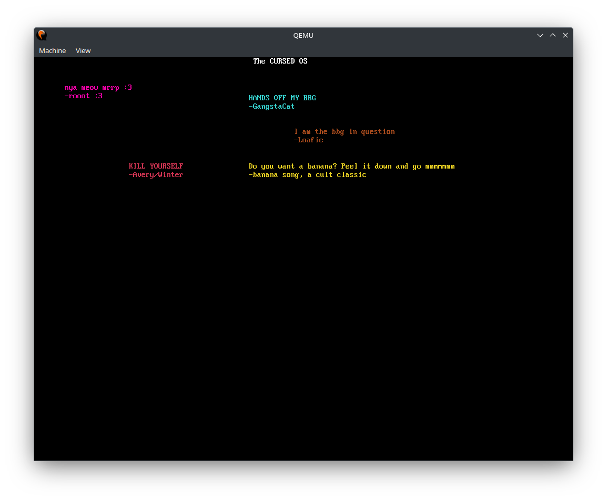

<h1>Cursed OS</h1>

This is an OS based on the Limine Barebones Template, and just
draws some text :3 
This was my first time actually using Limine and I found it quite fun to work with! 
Enjoy lol

<h2>How to build</h2>

Run "make" and if anything fails, then make an issue or figure out the bug yourself.

